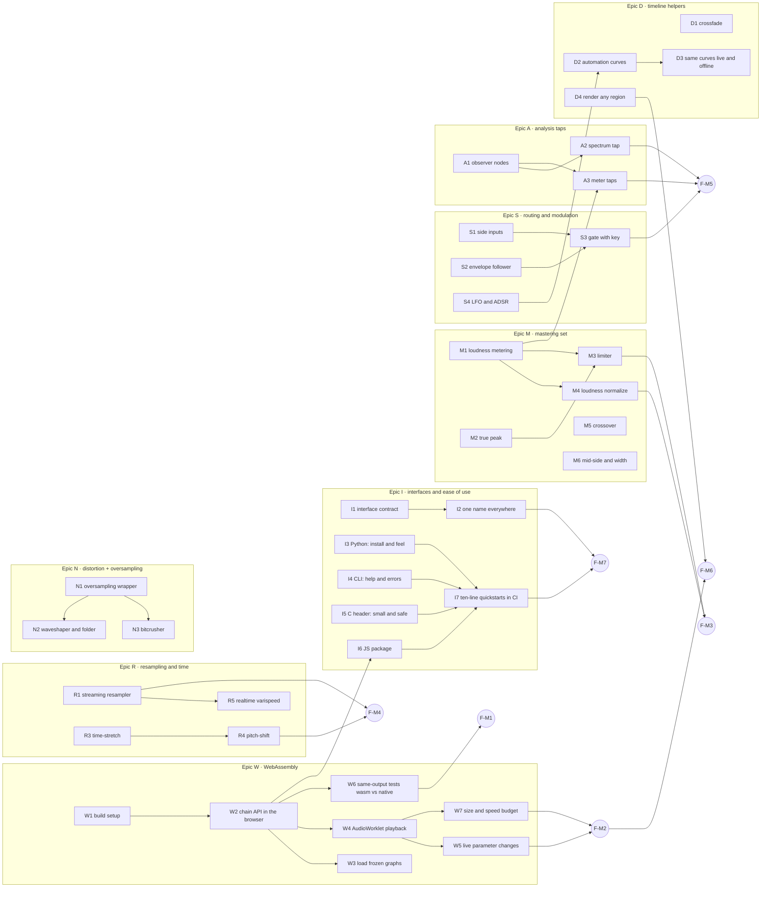

# Roadmap — the host-engine push

Goal: make Fluxion a complete audio engine for **host applications** — DAWs, editors, batch
pipelines, notebooks. One engine, same results everywhere: on a server, in a script, in the
browser.

Two ideas drive the order:

1. **WebAssembly first.** The same chain must render natively and preview in the browser.
   "Preview and export come from the same DSP" is the main reason to pick one engine instead of
   glueing three libraries together.
2. **Grow by families, not by single ops.** Streaming rate conversion, the mastering chain,
   sidechain routing, analysis taps, the nonlinear toolbox. Each family lands complete, with
   tests, on every interface.

And one promise that cuts across everything: **Fluxion must be easy.** One-line install, a
small and predictable API, the same names on every interface, error messages that tell you what
to fix. If a quickstart needs more than ten lines, the API is wrong — we fix the API, not the
docs. Epic I below makes this measurable.

Before planning we looked at the engine of [openDAW](https://github.com/andremichelle/openDAW)
(MIT), a browser DAW with a Rust core. It confirmed which tools a modern host actually uses
(spectral time-stretch, PSOLA, sidechain gate, FFT analyser, block meters, oversampled
distortion, LFO/ADSR) and it validated a test habit we already have: their pure-Rust port of
Signalsmith Stretch keeps the original C++ around *only as a test oracle*. The last section
lists what we saw and chose not to schedule yet.

Working rules, from [CONTRIBUTING.md](CONTRIBUTING.md):

- **Test first.** Every task starts from a failing check — a comparison against a trusted
  reference (SciPy, ffmpeg, a reference implementation), a property that must always hold, or
  an exact equality. The task is done when that check passes and stays in CI. Tests state their
  pre- and post-conditions in comments.
- **Small tasks.** One task, one PR, one behaviour, mergeable alone. The graph below shows the
  real dependencies; whatever is not connected can run in parallel.
- **A feature is done when all interfaces have it.** New op → CLI verb + Python call + C symbol
  + wasm export, or a written note saying why not. See Epic I.
- Shortcuts are allowed but marked: a `// ponytail:` comment says what the limit is and how to
  lift it.

Status: `[ ]` todo · `[~]` in progress · `[x]` done. Flip the box in the same PR that ships the
task.

---

## Dependency graph

Eight tracks, almost no lines between them: one track per person (or per session) and nobody
blocks anybody. The shared surface is the op catalogue and its names — that is exactly what I1
and I2 guard.

---

## Epic I — Interfaces and ease of use

Fluxion already has four doors: the Rust library, the CLI, Python, and the C header — wasm is
the fifth (Epic W). This epic makes them feel like **one product**: same mental model
everywhere ("build a chain, run it"), same names, one-line install, short code. Most tasks here
are cheap; their value is that they become the *definition of done* for everything else.

**Who uses what:**

| Interface | Who it is for | What it must expose |
|---|---|---|
| Rust (`fluxion`) | engine and app developers | everything: chain building, offline run, realtime, freeze/load, analysis taps |
| CLI (`fluxion`) | terminal users, scripts, CI | file in → file out: every offline op as a verb, `stat` for measurements, chain syntax for combinations |
| Python (`pip install fluxion`) | data/ML people, notebooks, batch jobs | offline processing on arrays (NumPy/torch, zero-copy), every op as a plain function plus the chain API, measurements as dicts |
| C header (`fluxion.h`) | C/C++/Swift hosts, plugin shells | the stable core: build chain from text, run on buffers, freeze/load; small on purpose |
| JS/wasm (npm) | web apps | offline render + AudioWorklet playback, chain from the same text syntax, typed API |

| # | Task | Depends on | The check written first |
|---|------|-----------|--------------------------|
| [x] I1 | Write the interface contract (a short doc in `docs/`): the table above, plus the rule "an op ships on all interfaces or explains why not". From then on it is part of every task's definition of done | — | CI check: every op in the registry appears in the contract table (generated, not hand-kept) |
| [x] I2 | One name everywhere: a single op registry drives CLI verb names, Python function names, C symbols and JS exports. No synonyms, no surprises | I1 | A generated cross-name table; the build fails if an interface drifts from the registry |
| [x] I3 | Python install and feel: prebuilt wheels for Linux/macOS/Windows (no Rust toolchain needed), `import fluxion as fx` → `fx.Wave.from_file(...) \| fx.filter.Highpass(80)` (torchfx-shaped: `Wave` carries `fs`, one class per op) or `fx.chain("highpass=80 \| gain=-3")(x, fs)`, typed stubs, errors that name the parameter and the valid range | — | CI: a fresh virtualenv on all three systems installs the wheel and runs the quickstart |
| [x] I4 | CLI help and errors: `--help` fits one screen, every error suggests a fix ("unknown effect `hipass`, did you mean `highpass`?"), `--dry-run` prints the chain it would run, progress on long files | — | Snapshot tests on help and on ten common mistakes |
| [x] I5 | C header, small and safe: one `.h`, no panics across the boundary, a compiling example in the repo | — | CI compiles and runs the C example on the three systems |
| [x] I6 | JS package: `npm install`, one `Chain` class that works both offline and in the worklet, TypeScript types generated from the registry | W2 | CI: the Node quickstart runs green |

> I6 completed with W4: the same `Chain` text builds an offline render or an `AudioWorkletNode`
> (`attachWorklet`), and both produce identical samples.
| [x] I7 | Ten-line quickstarts, one per interface, executed in CI so they can never rot. If one grows past ten lines, that is a bug in the API | I3, I4, I5, I6 | The quickstarts themselves, run on every PR |

## Epic W — WebAssembly first

`crates/fluxion-wasm` is an empty scaffold today (its own words). Target: the CPU engine in the
browser — same chain, offline render for waveforms and bounces, AudioWorklet for live playback.
The WebGPU path (W8) waits until F-M2 ships: the CPU slice already delivers the "same DSP
everywhere" story.

| # | Task | Depends on | The check written first |
|---|------|-----------|--------------------------|
| [x] W1 | Build setup: `cdylib` + wasm-bindgen, wasm target in the toolchain file, a build script, a CI job that compiles on every PR | — | CI: the crate builds; a Node smoke test loads the module and calls `version()` |
| [x] W2 | Chain API in the browser: build a chain from the same text/JSON the CLI accepts, run it over a `Float32Array` at a given sample rate, get the buffer back | W1 | Node test: `highpass=80 \| gain=-3` on a fixture sine matches the native CLI output within 1e-6 |
| [ ] W3 | Frozen graphs (`.fxg`) in the browser: load, verify, refuse broken files — the same checks as on a device | W2 | Node test: a good file loads and renders; a corrupted one is rejected with the same error as native |
| [x] W4 | AudioWorklet playback: the chain runs in 128-frame blocks, a lock-free ring moves audio in and out, no memory allocation once started | W2 | Browser test (Playwright): 5 s of playback, no dropped blocks, the wasm-side allocation counter stays at 0 |
| [x] W5 | Live parameter changes from the page to the worklet, smoothed like the native realtime engine, no clicks | W4 | Browser test: a 40 dB gain jump renders as a smooth ramp |
| [x] W6 | Same-output tests: every op exposed to wasm is rendered native and wasm on the same inputs and compared, with written tolerances, in CI | W2 | The comparison suite itself — red until every op matches |
| [x] W7 | Budget: wasm file ≤ 1.5 MB gzipped (trim the op set behind features if needed), one block costs ≤ 30% of its deadline on a mid laptop, both enforced in CI | W4 | A size check and a speed check with hard limits |
| [ ] W8 | *(later)* WebGPU lowering of the batch engine | W6 | — |

## Epic R — Resampling and time

Offline `resample` (windowed-sinc) and `speed` **already exist** in `fluxion-ops::transform`.
What is missing for a host: a **streaming** resampler (the offline one needs the whole signal
up front — realtime and the worklet cannot give it that), and time-stretch / pitch-shift as
**separate** controls (`speed` changes both together, on purpose). Hosts pin one project rate
and convert everything on the way in; this epic makes that cheap and correct.

| # | Task | Depends on | The check written first |
|---|------|-----------|--------------------------|
| [x] R1 | Streaming resampler: feed blocks in, get blocks out, all memory allocated up front, two quality levels (`fast` for scrubbing, `hq` = today's offline quality) | — | Reference test: noise + sweep 48k→44.1k vs `scipy.signal.resample_poly`; property: zero allocations after start |
| [ ] R2 | Project-rate helper: `ensure_fs(signal, rate)` on every input path (CLI, Python, wasm), so a host sets its rate once | R1 | Any input rate in → pinned rate out, length correct to ±1 frame |
| [x] R3 | Time-stretch (tempo changes, pitch does not), Signalsmith-Stretch class. Short study first: pure-Rust port vs binding, keeping the reference implementation as a test-only oracle — the approach openDAW's `signalsmith` crate proved workable | — | Output matches the reference on the fixture set within written tolerance; duration exact |
| [x] R4 | Pitch-shift (pitch changes, tempo does not), built from stretch + resample, exposed as one op in cents | R1, R3 | A 440 Hz sine shifted +1200 cents peaks at 880 Hz ± 1 Hz; duration unchanged |
| [ ] R5 | Realtime varispeed on the streaming resampler (scrubbing, tape-style effects) | R1 | Realtime harness: meets the block deadline, no allocations, no clicks on speed changes |
| [ ] R6 | *(optional)* PSOLA for single-voice pitch work — the light option where spectral stretch is overkill | R3 study | A sung vowel shifted a third keeps its character, measured against the PSOLA reference |

## Epic M — The mastering set

What a mastering chain needs and the dynamics module does not have yet (`compand` is alone
there): standard loudness measurement, a true-peak limiter, normalization, and the two tools
that turn the series/parallel algebra into multiband processing.

| # | Task | Depends on | The check written first |
|---|------|-----------|--------------------------|
| [x] M1 | Loudness metering per BS.1770: K-weighting (two biquads, already in the filter toolbox), gated integrated loudness, loudness range; shown by `stat` | — | ±0.1 LU vs ffmpeg and pyloudnorm on the fixture set; textbook case: −20 dBFS sine @1 kHz = −20.69 LUFS |
| [x] M2 | True peak with 4× oversampling, per the same standard | — | Known inter-sample-peak fixtures within 0.1 dB of ffmpeg |
| [x] M3 | True-peak limiter with lookahead, as a chain op: fixed and reported delay, realtime-safe | M1, M2 | Property test: the output never exceeds the ceiling, on any input; the delay is exactly the declared one |
| [x] M4 | Loudness normalize, two passes (measure → apply → verify) | M1 | Fixtures land within ±0.5 LU of target, true peak stays under the ceiling |
| [ ] M5 | Linkwitz-Riley crossover; multiband compression then needs no new op: `(low \| comp) + (mid \| comp) + (high \| comp)` | — | The crossover bands sum flat (±0.1 dB) — checked, not assumed |
| [ ] M6 | Mid/side encode–decode and stereo width (cousins of `remix`) | — | Encode then decode returns the input to 1e-7; width 0 is mono, width 1 changes nothing |

## Epic S — Routing and modulation

Today a chain carries one signal. Real hosts route **two**: a compressor pushed down by the
kick drum, a gate opened by a different microphone. Side inputs are a change to the chain
algebra, not just another op — so they get their own epic, and the gate is the proof it works,
not the end goal.

| # | Task | Depends on | The check written first |
|---|------|-----------|--------------------------|
| [ ] S1 | Side inputs in the chain algebra: an op can declare a "key" input, connected when the chain is built; ops with one input behave exactly as before | — | All existing algebra tests pass unchanged; a two-input test op receives both signals sample-aligned |
| [ ] S2 | Envelope follower (attack/release, peak and RMS) — the building block under gates, duckers and meters | — | A step input follows the attack curve within 1e-4; SciPy reference on noise |
| [ ] S3 | Noise gate with optional key input (threshold, range, attack/hold/release) | S1, S2 | Below threshold the signal drops by exactly `range`; with a key, the gate follows the key, not the program |
| [ ] S4 | LFO and ADSR as parameter sources, defined with the same curves as automation | — | The same description gives identical curves in the batch and realtime engines |

## Epic A — Analysis taps

Hosts draw meters and spectrums while audio plays; scripts want measurements without a second
pass. Today `stat` is offline only. Observer nodes make analysis a **tap on the chain**: they
read, they never touch the audio.

| # | Task | Depends on | The check written first |
|---|------|-----------|--------------------------|
| [ ] A1 | Observer nodes: an op that reads the stream and publishes a snapshot, provably invisible to the audio (no allocation, no change to the signal) | — | A chain with N observers produces bit-identical audio to the chain without them |
| [ ] A2 | Spectrum tap (windowed FFT, size and overlap configurable) for analyser views | A1 | The spectrum of a known multitone matches SciPy within tolerance |
| [ ] A3 | Meter taps: peak, RMS, and short-term loudness reusing M1's filters | A1, M1 | Short-term loudness of the standard fixture matches the offline meter within 0.1 LU |

## Epic N — Distortion + oversampling

Waveshaping, folding and bitcrushing are the cheapest colour a host offers — and the easiest
way to ship aliasing. One shared wrapper handles the oversampling (openDAW oversamples its
folder for the same reason); each distortion is then a small pure function with a hand-written
gradient, so it stays differentiable like the rest of the op set.

| # | Task | Depends on | The check written first |
|---|------|-----------|--------------------------|
| [ ] N1 | Oversampling wrapper: run a pure `f(x)` at 2× or 4×, downsample after, report the delay | — | A folded 5 kHz sine at 4× shows alias products at least 40 dB below the 1× version |
| [ ] N2 | Waveshaper (tanh and asymmetric curves) and wavefolder, with drive and bias, gradients included | N1 | Static curves vs SciPy; gradient check against finite differences, as the autodiff suite already does |
| [ ] N3 | Bitcrusher / rate decimator (bit depth, rate, jitter) | N1 | Quantization error stays within 1 LSB of the closed-form staircase |

## Epic D — Timeline helpers

Four things every timeline renderer rebuilds on its own, usually badly. They move into the
engine, once, with tests.

| # | Task | Depends on | The check written first |
|---|------|-----------|--------------------------|
| [ ] D1 | Crossfade over `concat` (linear and equal-power), sample-accurate | — | An equal-power crossfade of a signal with itself leaves the level unchanged (±1e-6) |
| [ ] D2 | Automation: breakpoint curves applied to any op parameter, compiled to per-block ramps; one curve format shared with S4 | S4 curves | A gain automated 0→−60 dB over 1 s matches the exact envelope sample by sample |
| [ ] D3 | Check that live parameter ramps (`fluxion-rt`) and D2 curves use one definition — what you hear live is what renders | D2 | The same breakpoints give identical envelopes offline and in the realtime engine |
| [ ] D4 | Render any region: compute `[from, to)` of a chain deterministically (seek) — the base for waveform tiles, loop preview, partial re-render | — | Rendering `[0,N)` whole equals rendering it in random pieces, bit for bit |

---

## Milestones

| ID | Milestone | How we know it is true | What it opens |
|----|-----------|------------------------|---------------|
| ✅ F-M1 | **wasm renders** | A browser or Node loads the module, builds a chain, renders a buffer; the wasm-vs-native suite is green | Waveforms and bounces in any web host |
| ✅ F-M2 | **worklet plays** | Live playback, 128-frame blocks, smooth parameter changes, zero allocations, size and speed budgets enforced | Live preview with the same DSP as the final render |
| ✅ F-M7 | **easy everywhere** | Four ten-line quickstarts run in CI; names come from one registry; `pip install` works without a Rust toolchain | The library people actually pick up |
| ✅ F-M3 | **mastering complete** | Loudness, true peak, limiter and normalize as ops, ±0.1 LU vs ffmpeg | A full mastering chain with no external tool |
| ✅ F-M4 | **time tools** | Streaming rate conversion on every input; stretch and pitch as separate controls, tested against a reference | Import at any rate, scrubbing, tempo and pitch edits |
| F-M5 | **routing and taps** | A keyed gate works end to end; spectrum and meter taps are provably invisible to the audio | Duckers, keyed dynamics, live analysers |
| F-M6 | **host-render ready** | Epic D done: a timeline of clips, fades and automation renders bit-exact, in one pass or in pieces, native and wasm | Fluxion as the single engine behind a timeline |

**Reached so far.**

- **F-M1 — wasm renders.** Node loads the module, builds a chain from the shared text and renders a
  buffer; the wasm-vs-native suite covers all 27 ops plus five chain topologies, and 26 of the 32
  cases are bit-identical to native. The six that are not are the ops calling a transcendental per
  sample (`overdrive`, `phaser`, `compand`, `fade`, `tremolo`), where wasm's libm and the
  platform's differ in the last bit — at most two ULP, tabulated in
  `crates/fluxion-wasm/tests/parity.rs`.
- **F-M2 — worklet plays.** A real AudioWorklet hosts the chain on the audio thread, 128 frames at
  a time, fed through a lock-free ring. Five seconds of playback allocates **nothing** on the wasm
  side and drops no block; a 40 dB gain change arrives as a ramp (largest per-sample step 1e-3,
  against the 0.99 a step would give). The module is 193 KB gzipped of the 1.5 MB budget, and a
  five-filter mastering chain costs 0.11% of its 2.67 ms block deadline. The worklet's output is
  bit-identical to the offline render — checked in Node and again inside a browser, which is the
  concrete form of "preview and export come from the same DSP".
- **F-M3 — mastering complete.** Loudness (BS.1770), true peak, a true-peak limiter and loudness
  normalize, the last two as chain ops so they reach every interface. Integrated loudness agrees
  with pyloudnorm and ffmpeg to within 0.058 LU, against the 0.1 LU the milestone asks for. True
  peak is pinned against analytic truth rather than a reference, because measurement showed ffmpeg
  reads up to 0.8 dB high near Nyquist — see `crates/fluxion-ops/tests/loudness_golden.rs`.
- **F-M7 — easy everywhere.** Five ten-line quickstarts run in CI (six lines to ten, against a
  budget of ten); every name comes from the one registry in `fluxion-core/src/op.rs`; `pip install`
  works with no Rust toolchain on Linux, macOS and Windows. See [docs/interfaces.md](docs/interfaces.md).

With one person: W1–W2 first (they unblock the most), I1–I2 the same week (they are cheap and
change every later task's definition of done), then M1 next to W4, then follow the graph. With
more people: one track each.

---

## Seen, liked, not scheduled

Things we found in the wild (mostly in openDAW's engine) that are worth having, but that wait
until something concrete needs them: a second reverb (Dattorro), a **vocoder** (it needs S1
side inputs first — that is the real prerequisite, and part of why S1 is scheduled), **pitch
correction** (PSOLA plus pitch tracking; R6 is half of it), a **neural op** (running small
trained models as chain nodes — a natural fit for a differentiable engine, but it needs its own
design round on formats and realtime limits), and sampler/soundfont playback (that is the
host's job, not the engine's). Any of these becomes one more row in an epic the day it has a
real user; none of them blocks a milestone.
